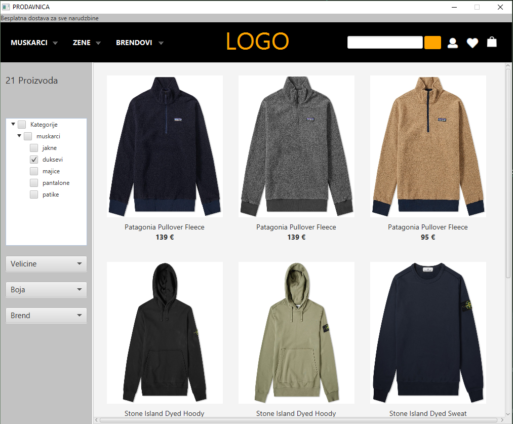
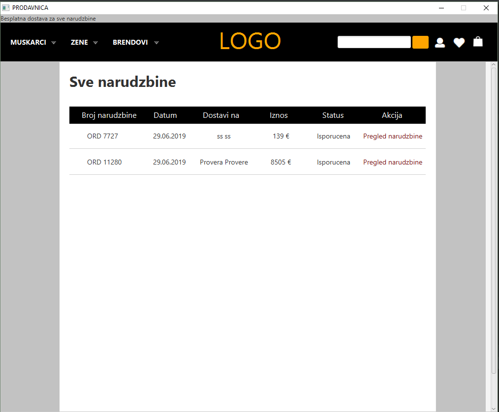

 

# Web Shop 
Prototype of a Clothing Store made in JavaFX made for the course _Software Specification Modeling_

## Object Oriented Model

You can find a detailed Class, Use Case, State, as well as multiple Sequence and Activity diagrams in the folder _dijagrami_

## Design

The core of the application consists of a couple of scenes from which the user ineracts with the shop itself.

First up is the main window which has options to browse store items, search them by name or category, or go to other scenes such as Log In/Registration, or for example Wish List and User's Cart.

 

It is not necessary for just placing orders, but to be able to track them and use all functionalities in the application, users should first Log in to their personal account or Register if they don't have one. 

Next up is the Catalogue scene where we have the grid of store-sold items and comboboxes to help us filter those items.

Now, we can choose to see detailed view of any of these items by clicking on them:

Here we can see differenet pictures, as well as other similar products, and choose size and add the item to the cart or the wish list.

Once we have added items to our cart we can change their quantity and finally order them

After placing the order, user can see that as well as all the other orders placed from the account, along with their status:

## Goal 

The goal of this project was to mainly to understand and implement complex Object Oriented Models for real-life problems as well as to learn new technologies (JavaFX and SceneBuilder)

Although the application isn't perfect, it was never supposed to be, it has just a portion of functionalities compared to every other web retail store out there

## References
 - [END.](https://www.endclothing.com/gb/) for the product images and desctiptions

